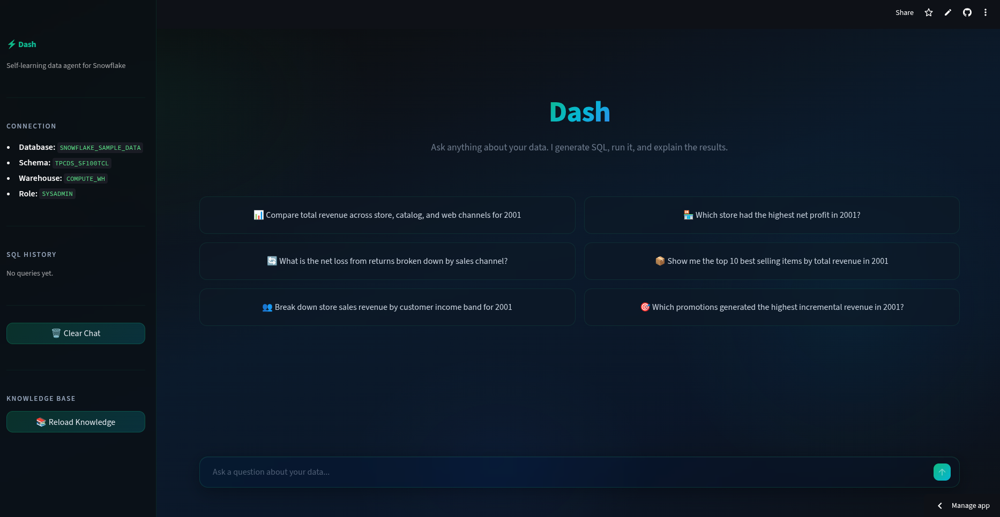

# Dash: Self-Learning Data Agent

Dash is an AI-powered conversational agent that lets anyone ask plain-English questions about a massive retail dataset and get real answers backed by live SQL. Instead of requiring analysts to write queries, you just ask: *"What is total store revenue for 2001?"* or *"Which channel has the highest profit margin?"* and Dash figures out the SQL, runs it, and returns an insight.

Built with the **AWS Strands Agents SDK**, Dash runs against the **TPC-DS SF100TCL** benchmark dataset on Snowflake — a 100 TB, ~560 billion row retail decision-support dataset covering store, catalog, and web sales channels.

The defining feature of Dash is that it **learns from every interaction**. Successful queries, discovered fixes, and user corrections are stored in a local vector database and retrieved automatically on future questions. The agent also starts every session with the full database schema already loaded into its context, so it knows table structures, column types, business metrics, and common gotchas before the first query is written.



---

## 🏗️ Architecture Overview

Dash uses a **multi-agent architecture** with a persistent Leader that delegates to two persistent specialists. All three agents are created once per session and retain conversation history across turns.

```text
┌──────────────────────────────────────────┐
│             Streamlit (UI)               │
│         User types a question            │
└────────────────────┬─────────────────────┘
                     │
                     ▼
         ┌───────────────────────┐
         │        LEADER         │
         │                       │
         │  Routes to the right  │
         │  specialist. Synth-   │
         │  esizes the answer.   │
         │  No SQL access.       │
         └──────────┬────────────┘
                    │
         ┌──────────┴──────────┐
         ▼                     ▼
 ┌───────────────┐   ┌──────────────────┐
 │   ANALYST     │   │    ENGINEER      │
 │               │   │                  │
 │ Answers data  │   │ Builds views and │
 │ questions     │   │ summary tables   │
 │ with SQL.     │   │ in dash schema.  │
 │ (READ ONLY)   │   │ (WRITE: dash.*)  │
 └──────┬────────┘   └────────┬─────────┘
        │                     │
        ▼                     ▼
    Snowflake             Snowflake
(TPCDS_SF100TCL.*)    (DASH_AGENT.dash.*)
```

---

## 🤖 The Three-Agent System

### 1. Leader
The only agent the user talks to directly. Understands the request, routes it to the right specialist, and synthesizes the final answer. Has no SQL tools — it delegates everything and explains.

**Key behaviors:**
- Routes data questions to the **Analyst**, infrastructure requests to the **Engineer**.
- When the Engineer builds a view, the Leader immediately delegates to the Analyst to query it and return real numbers — never hands SQL back to the user.
- Decomposes complex multi-part questions into sub-questions, delegates each, and synthesizes across all results.
- Proactively routes to the Engineer first when a question would require an expensive raw-table scan.

### 2. Analyst
Answers data questions with live SQL against Snowflake.

- **Read-only** access to `SNOWFLAKE_SAMPLE_DATA.TPCDS_SF100TCL.*` and `DASH_AGENT.dash.*`.
- Starts every session with the full TPC-DS schema and business rules already embedded in its system prompt — no schema lookup needed for standard questions.
- Searches the knowledge base for validated queries and past learnings before writing SQL.
- Enforces date filters on all fact tables via a pre-flight safety guard — blocked queries are retried automatically with the correct filter.
- Saves successful query patterns and error fixes back to the knowledge base.

### 3. Engineer
Builds reusable analytics infrastructure in the `dash` schema.

- **Write access only to `DASH_AGENT.dash`** — never touches source data.
- Creates `VIEW`s and summary tables (e.g. `dash.monthly_store_revenue`, `dash.top_items_by_category`) on top of TPC-DS source tables.
- Starts with source table schemas embedded in its prompt — builds immediately without excessive introspection.
- Registers every new object in the knowledge base so the Analyst can discover and use it in future queries.

---

## 🛒 Database Structure

Two databases are used:

### `SNOWFLAKE_SAMPLE_DATA.TPCDS_SF100TCL` — Source Data (Read-Only)

**Fact Tables** (always filter by date — billions of rows):

| Table | Approx. Rows | Description |
|-------|-------------|-------------|
| `STORE_SALES` | ~300B | In-store transactions |
| `CATALOG_SALES` | ~144B | Catalog channel orders |
| `WEB_SALES` | ~72B | Web channel orders |
| `STORE_RETURNS` | ~87B | In-store returns |
| `CATALOG_RETURNS` | ~43B | Catalog returns |
| `WEB_RETURNS` | ~21B | Web returns |
| `INVENTORY` | ~1.3B | Daily warehouse inventory snapshots |

**Dimension Tables (17):** `CUSTOMER`, `CUSTOMER_ADDRESS`, `CUSTOMER_DEMOGRAPHICS`, `DATE_DIM`, `TIME_DIM`, `ITEM`, `STORE`, `PROMOTION`, `CALL_CENTER`, `CATALOG_PAGE`, `WEB_SITE`, `WEB_PAGE`, `WAREHOUSE`, `SHIP_MODE`, `REASON`, `HOUSEHOLD_DEMOGRAPHICS`, `INCOME_BAND`

### `DASH_AGENT.dash` — Agent Workspace (Write Access)
Starts empty. The Engineer populates this with views such as `dash.monthly_store_revenue`, `dash.top_items_by_category`, `dash.store_performance_ranking`, etc. The Analyst always checks here first before touching raw fact tables.

---

## 🧠 How Dash Knows the Schema

Rather than discovering the schema on every question, Dash pre-loads table metadata directly into the agent system prompts at startup using two runtime context builders:

- **Semantic model** — all 24 TPC-DS table definitions (full path, description, key columns with types, data quality notes) are read from `knowledge/tables/*.json` and injected into the Analyst and Engineer prompts as a `SEMANTIC MODEL` section.
- **Business context** — metrics definitions, sales channel mappings, product hierarchy, dimension table sizes, common gotchas, and recommended query patterns are read from `knowledge/business/tpcds_retail_rules.json` and appended to the Analyst prompt.

This means the agent knows which table to query, which column to use for revenue, and that `STORE_SALES` has ~300B rows before the user even finishes typing.

---

## 📊 Automatic Chart & Table Rendering

Every response that contains data is automatically formatted by the agent and rendered natively in the UI — no user action required.

### Tables
When a result has multiple rows, the agent always formats it as a **GitHub-flavoured markdown table** (never bullet points). Numeric columns are right-aligned and large numbers are formatted with SI suffixes (`$14.2T`, `3.5M`). Streamlit renders these natively.

### Charts
When the data is also visually meaningful, the agent appends a structured `chart` block which `app.py` extracts, strips from the displayed text, and renders as an interactive Plotly figure. The chart block is **never visible to the user** — only the rendered figure is shown.

**Supported chart types:**

| Type | When used |
|------|----------|
| `bar` | Comparing ≤ 8 categories by a single metric |
| `horizontal_bar` | Same, but with long labels or > 8 items |
| `line` | Ordered time series (monthly, yearly trends) |
| `pie` | Part-of-whole with ≤ 6 slices |
| `donut` | Same as pie, preferred when a grand total matters |
| `scatter` | Two numeric dimensions per item (e.g. revenue vs return rate) |

**Multi-series charts:** When the result spans both a time/category dimension and a grouping dimension (e.g. monthly revenue broken out by Store / Catalog / Web), the agent uses a `series` format that produces one line or bar group per category — not a flattened single series.

**Implementation:**
- `extract_chart(text)` — regex extracts the `chart` JSON block and returns `(spec, cleaned_text)`. The block is removed from displayed markdown.
- `render_chart(spec)` — builds a `plotly.graph_objects` figure and renders it via `st.components.v1.html()` using Plotly loaded from CDN. This bypasses Streamlit's bundled `PlotlyChart.js` to avoid dynamic-import failures in proxied/tunnelled environments.
- Charts are stored in `st.session_state.chart_map` (keyed by message index) and re-rendered on page reload.

---

## 🧠 The Self-Learning System

Dash also gets smarter over time using a local **ChromaDB** vector database. Two types of memory:

1. **Knowledge** — Pre-loaded table metadata, validated SQL query patterns, and business rules. The Analyst searches this before writing SQL to reuse proven patterns.
2. **Learnings** — When Dash fixes a bad query or encounters a data quirk, it saves the fix automatically. Future similar questions benefit from past mistakes.

---

## ⚠️ Key TPC-DS Gotchas

Built into the agent prompts and knowledge base — listed here for reference:

- **Always filter fact tables by date** — `STORE_SALES` has ~300B rows. Every query must join `DATE_DIM` and filter on `D_YEAR`. The Analyst enforces this automatically; blocked queries are retried with the correct filter.
- **SCD Type 2 dimensions** — `ITEM`, `STORE`, `WEB_SITE`, `CALL_CENTER` have historical versions. Always add `WHERE I_REC_END_DATE IS NULL` for current records.
- **Y/N flags are VARCHAR** — `D_HOLIDAY`, `C_PREFERRED_CUST_FLAG`, etc. Use `= 'Y'`, not `= 1` or `IS TRUE`.
- **TPC-DS date range** — Data covers years 1998–2002. Default to `D_YEAR = 2001` for the most complete full year.
- **Cross-channel totals** — Must `UNION ALL` across `STORE_SALES`, `CATALOG_SALES`, and `WEB_SALES` — never join them.
- **Inventory is a snapshot table** — Do not `SUM(INV_QUANTITY_ON_HAND)` across dates. Use `MAX(INV_DATE_SK)` per item-warehouse pair to get the latest snapshot.

---

## 🚀 Setup and Running

### Prerequisites
- Python 3.11+
- Snowflake account with access to `SNOWFLAKE_SAMPLE_DATA`
- Azure OpenAI API key (used for both chat and embeddings)

### 1. Install Dependencies
```bash
python -m venv venv
source venv/bin/activate      # Windows: venv\Scripts\activate
pip install -r requirements.txt
```

### 2. Configure Environment Variables
Create a `.env` file in the project root:

```text
# Azure OpenAI
AZURE_OPENAI_ENDPOINT=https://<your-endpoint>.openai.azure.com/
AZURE_OPENAI_API_KEY=<your-key>
API_VERSION=2025-01-01-preview
CHAT_DEPLOYMENT=gpt-4o
EMBEDDING_DEPLOYMENT=text-embedding-3-small

# Snowflake — source (read-only)
SF_ACCOUNT=<your-account>
SF_USER=dash_user
SF_PASSWORD=<your-password>
SF_DATABASE=SNOWFLAKE_SAMPLE_DATA
SF_SCHEMA=TPCDS_SF100TCL
SF_WAREHOUSE=COMPUTE_WH
SF_ROLE_ANALYST=dash_analyst_role
SF_ROLE_ENGINEER=dash_engineer_role

# Snowflake — writable database for agent views
SF_DASH_DATABASE=DASH_AGENT

# ChromaDB
CHROMA_PATH=./chroma_data
```

### 3. Run Snowflake Setup (Once)
Execute `snowflake_setup/setup.sql` as `ACCOUNTADMIN` in your Snowflake account. This script:
- Creates `dash_analyst_role` and `dash_engineer_role`
- Creates user `dash_user` and assigns roles
- Grants read access to `SNOWFLAKE_SAMPLE_DATA` and `COMPUTE_WH`
- Creates the `DASH_AGENT` database and `dash` schema
- Sets warehouse size to X-Large with auto-suspend

### 4. Load the Knowledge Base (Once)
Embeds all table metadata, SQL patterns, and business rules into ChromaDB:
```bash
python scripts/load_knowledge.py --recreate
```

### 5. Run the App
```bash
streamlit run app.py
```
Opens at `http://localhost:8501`. See `Sample_Questions.md` for questions to try.

---

## 🧪 Running Evals

Dash includes a smoke test suite that runs the live agent stack and validates responses with regex assertions — no judge model required.

```bash
# Run all 21 tests
python -m evals smoke

# Run a single group
python -m evals smoke --group metrics
python -m evals smoke --group edge_cases

# Show full responses
python -m evals smoke --verbose
```

**Test groups:** `warmup`, `simple_data`, `metrics`, `data_quality`, `multistep`, `insight`, `engineering`, `edge_cases`

---

## 📁 Project Structure

```text
.
├── app.py                          # Streamlit chat UI
├── requirements.txt
├── .env                            # Environment variables (not committed)
├── Sample_Questions.md             # Example prompts to try
│
├── evals/                          # Smoke test suite
│   ├── __init__.py                 # Category registry
│   ├── __main__.py                 # CLI entry point (python -m evals smoke)
│   └── smoke.py                    # 21 tests across 8 groups
│
├── knowledge/                      # Pre-loaded into ChromaDB at startup
│   ├── tables/                     # 24 TPC-DS table metadata JSONs
│   │   ├── store_sales.json
│   │   ├── catalog_sales.json
│   │   ├── web_sales.json
│   │   └── ... (21 more)
│   ├── queries/                    # Validated SQL query patterns
│   │   ├── top_items_by_revenue.sql
│   │   └── ... (11 more)
│   └── business/
│       └── tpcds_retail_rules.json # Metrics, gotchas, channel mappings
│
├── scripts/
│   ├── init_db.py                  # Creates DASH_AGENT.dash schema in Snowflake
│   └── load_knowledge.py           # python scripts/load_knowledge.py --recreate
│
├── snowflake_setup/
│   └── setup.sql                   # Run once as ACCOUNTADMIN
│
└── src/dash_strands/
    ├── config.py                   # Env var loader (all settings in one place)
    ├── instructions.py             # Dynamic system prompt builders
    │                               #   build_analyst_instructions()
    │                               #   build_engineer_instructions()
    │                               #   build_leader_instructions()
    │
    ├── context/                    # Runtime context injected into prompts
    │   ├── semantic_model.py       # Reads tables/*.json → SEMANTIC MODEL section
    │   └── business_rules.py       # Reads business/*.json → metrics, gotchas, etc.
    │
    ├── agents/
    │   ├── leader.py               # get_leader() — creates all 3 persistent agents
    │   ├── analyst.py              # create_analyst() / run_analyst()
    │   └── engineer.py             # create_engineer() / run_engineer()
    │
    ├── db/
    │   └── __init__.py             # Snowflake SQLAlchemy engine factory
    │                               #   get_readonly_engine() — SNOWFLAKE_SAMPLE_DATA
    │                               #   get_write_engine()    — DASH_AGENT.dash
    │
    ├── knowledge/
    │   └── store.py                # ChromaDB client + Azure embedding function
    │
    └── tools/
        ├── introspect_schema.py    # introspect_schema(action, table_name)
        ├── knowledge_search.py     # knowledge_search(query)
        ├── save_learning.py        # save_learning(problem, fix)
        ├── save_validated_query.py # save_validated_query(name, description, sql)
        ├── sql_dash_write.py       # execute_sql_dash(sql) — write to dash schema
        ├── sql_readonly.py         # execute_sql_readonly(sql) — read-only + safety guard
        └── update_knowledge.py     # update_knowledge(object_name, ...) — register dash views
```

---

## 🛠️ Tech Stack

| Layer | Technology | Role |
|-------|-----------|------|
| **Agent Framework** | [AWS Strands Agents SDK](https://github.com/strands-agents/sdk-python) | Multi-agent orchestration |
| **LLM** | Azure OpenAI — `gpt-4o` | Reasoning, SQL generation, synthesis |
| **Embeddings** | Azure OpenAI — `text-embedding-3-small` | Semantic knowledge search |
| **Data Warehouse** | Snowflake (`SNOWFLAKE_SAMPLE_DATA.TPCDS_SF100TCL`) | 100TB TPC-DS retail dataset |
| **Agent Workspace** | Snowflake (`DASH_AGENT.dash`) | Views and summary tables built by the Engineer |
| **Vector Store** | ChromaDB (local persistent) | Knowledge base and learnings memory |
| **UI** | Streamlit | Chat interface |
| **Charting** | Plotly (`plotly.graph_objects`) + CDN rendering | Interactive charts rendered via `st.components.v1.html` |
| **Language** | Python 3.11+ | — |

---

## ⚠️ Limitations

- **Query cost** — Fact tables have hundreds of billions of rows. The Analyst enforces date filters via a pre-flight safety guard that blocks queries without a `D_YEAR` filter before they hit Snowflake. Vague questions may still be expensive.
- **TPC-DS date range** — All data covers years 1998–2002. Questions about "current" data default to 2001.
- **ChromaDB is local** — The vector store lives in `./chroma_data`. It is not shared across machines. Each new environment needs its own `load_knowledge.py` run.
- **No streaming** — Responses appear all at once after the agent finishes. Long multi-step queries may feel slow.
- **SQL extraction is heuristic** — The "View SQL" expander in the UI uses regex to find SQL blocks in responses. Complex multi-block responses may not extract cleanly.

---

## 🙏 Credits

- **Dataset** — [TPC-DS](https://www.tpc.org/tpcds/) benchmark, provided as `SNOWFLAKE_SAMPLE_DATA` in Snowflake.
- **Agent SDK** — [AWS Strands Agents](https://github.com/strands-agents/sdk-python)
- **LLM & Embeddings** — [Azure OpenAI Service](https://azure.microsoft.com/en-us/products/ai-services/openai-service)
